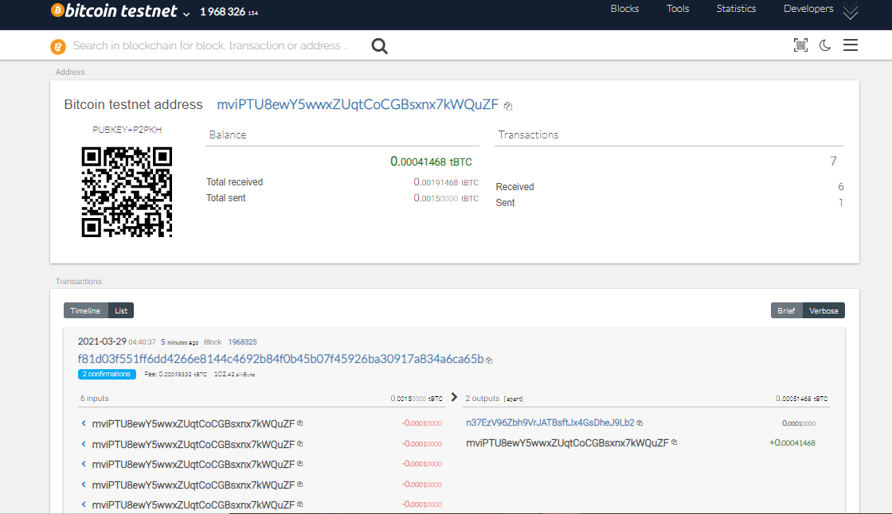
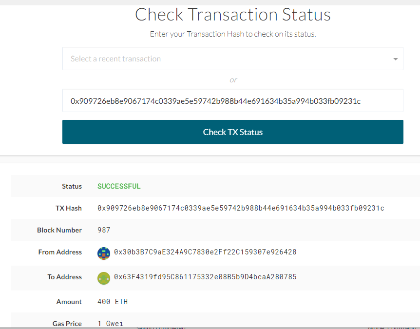

# MultiBlockchain Wallet in Python-Homework

## Overview

This project allows a user to derive testnet BitCoin and Ethereum crypto wallets from a cryptocurrency account, and send transactions between wallets via Python in a command line interface. 

## Dependencies

In order to run, you must ensure that:
* The [hd-wallet-derive](https://github.com/dan-da/hd-wallet-derive) repo is added into the "wallet" directory. It was not possible to push the repo to GitHub with this included in it.  
* The following libraries and technologies are installed in your developer environment:
  * Web3
  * Bit
  * PHP
  * [MyCrypto](https://mycrypto.com/)

## Instructions

1. Create **.env** file and add Mnemonic as key
2. Direct to the **wallet** directory in your Command Prompt / Terminal.
3. Run `python`
4. Within the Python shell, run the command `from wallet import *`
5. Derive the crypto wallets associated with the account using the following function:
    * `derive_wallets(mnemonic,{BTCTEST or ETH or LTC},{# of wallets to derive})`

### BitCoin

6. Ensure the account you would like to send funds from has been topped up via a [testnet faucet](https://coinfaucet.eu/en/btc-testnet/).
    * Use the **address** output from the desired account.
7. Initiate a transaction using the following function:
    * `send_tx(BTCTEST,{sender address from step 6},{receiving address},{amount})`
8. Monitor the transaction on a [block explorer](https://tbtc.bitaps.com/). 

### Ethereum

6. Add one of the ETH addresses to the pre-allocated accounts in your **networkname.json** file.
7. Delete the geth folder in each node, then re-initialize using `geth --datadir node3 init bullion_config.json`. This will create a new chain, and will pre-fund the new account.
8. Due to a bug in **web3.py**, you will need to send a transaction or two with MyCrypto first, since the `w3.eth.generateGasPrice()` function does not work with an empty chain. You can use one of the ETH address privkey, or one of the node keystore files.
9. Initiate a transaction using the following function:
    * `send_tx(ETH,{sender address from step 6},{receiving address},{amount})`
10. Monitor the transaction on MyCrypto by inputting the `txid` into the TX Status section.

## Execute Transaction

***Bitcoin Testnet transaction***

- Fund a `BTCTEST` address(n37EzV96Zbh9VrJATBsftJx4GsDheJ9Lb2 or mviPTU8ewY5wwxZUqtCoCGBsxnx7kWQuZF) using [this testnet faucet](https://testnet-faucet.mempool.co/).

- Use a [block explorer](https://tbtc.bitaps.com/) to watch transactions on the address.

***BTCTEST Transaction***
    
    `btc_acc = priv_key_to_account(BTCTEST,btc_PrivateKey)`
    `create_tx(BTCTEST,btc_acc,"n3LUACXpQwtkCiKNBEeASurVxUTd1nmgAh", 0.00000001)`
    `send_txn(BTCTEST,,btc_acc,btctest_address,0.001)`

    Confirmation on executed transaction

***ETH Transaction - Local PoA***

- Add one of the `ETH` addresses to the pre-allocated accounts in `bullion_config.json`

- Initialize using `geth --datadir nodeX init bullion_config.json`.

- [Add the following middleware](https://web3py.readthedocs.io/en/stable/middleware.html#geth-style-proof-of-authority)
  to `web3.py` to support the PoA algorithm:

   `from web3.middleware import geth_poa_middleware
    w3.middleware_onion.inject(geth_poa_middleware, layer=0)`

- Connect to HTTP with address private key & check the balance of the account
    `w3 = Web3(Web3.HTTPProvider("http://127.0.0.1:8545"))`
    `w3.eth.getBalance("0x30b3B7C9aE324A9C7830e2Ff22C159307e926428")`

- Due to a bug in `web3.py`, send a transaction or two with MyCrypto first, since the
  `w3.eth.generateGasPrice()` function does not work with an empty chain. Use one of the `ETH` address `privkey`,
  or one of the `node` keystore files.
    
- Send a transaction from the pre-funded address within the wallet to another, then get the `TxStatus` from MyCrypto
    `

